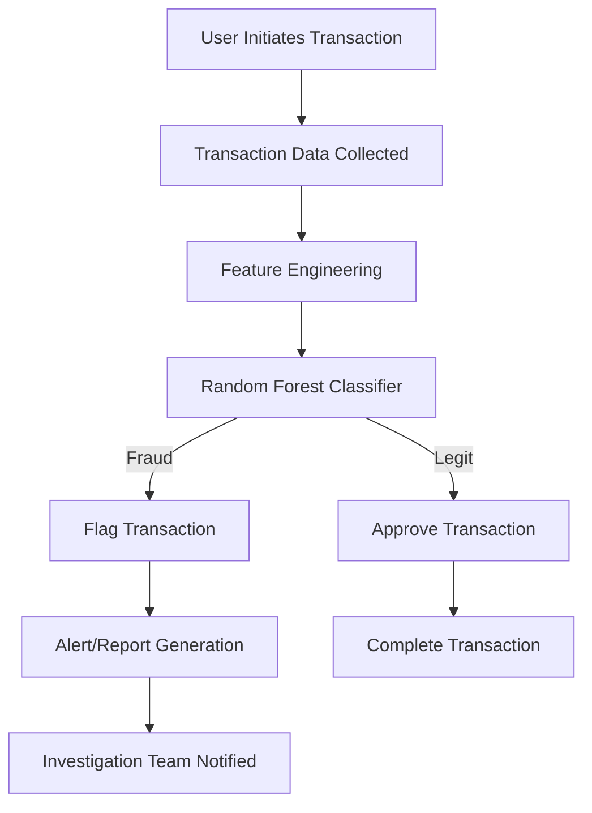
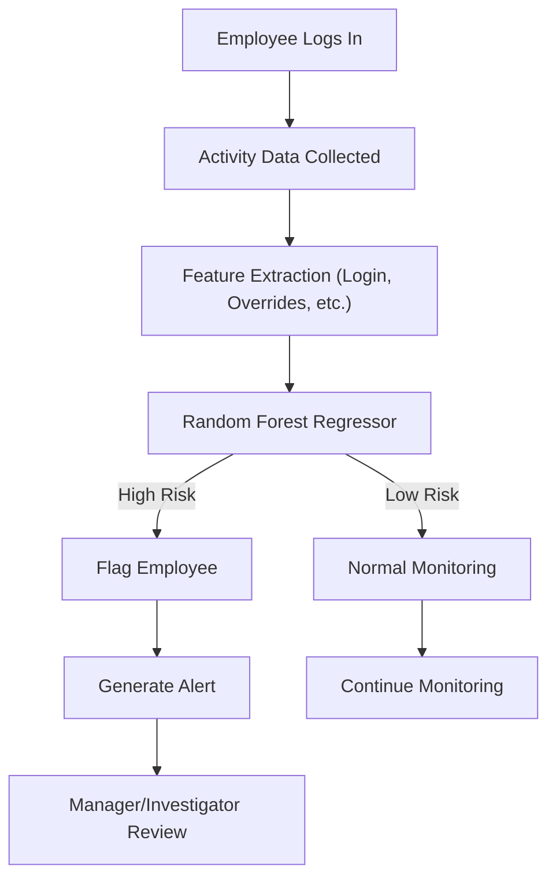
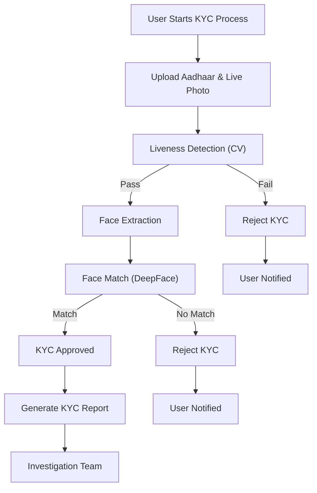

# Fraud Guardian

## Problem Statement

Financial institutions face a growing threat from multiple types of fraud, including:
- **Transaction-based fraud:** Unauthorized or suspicious transactions by external actors.
- **Insider fraud:** Malicious or risky behavior by employees with system access.
- **KYC-related fraud:** Attempts to bypass identity verification using fake or stolen documents.

## Our Multi-Faceted Solution

Fraud Guardian addresses these threats with a layered, AI-driven approach:

---

### 1. Transaction-Based Fraud Detection

- **How:** We use a Random Forest classifier to analyze transaction logs, leveraging features such as transaction time, location, merchant frequency, and user demographics.
- **Where:** See [`Fraud_Guardian/Transactions/model.py`](Fraud_Guardian/Transactions/model.py)
- **Key Technologies:** 
  - `scikit-learn` (RandomForestClassifier, feature engineering)
  - `pandas`, `numpy` for data processing

**User Flow:**

**Video Demonstration:**
- [Transaction Fraud Detection Demo](https://drive.google.com/file/d/1WgTyui917R_p_FktueX8mgUJGVqKQA9r/view?resourcekey)

---

### 2. Insider Fraud Detection (Employee Behavior)

- **How:** We profile employee activity using a Random Forest Regressor, analyzing login/logout patterns, failed logins, manual overrides, and more. The system flags risky employees and generates alerts for suspicious behavior.
- **Where:** See [`Fraud_Guardian/Employee_behavior/emp.py`](Fraud_Guardian/Employee_behavior/emp.py)
- **Key Technologies:** 
  - `scikit-learn` (RandomForestRegressor)
  - `streamlit` for interactive dashboards
  - `pandas`, `seaborn`, `matplotlib` for analytics and visualization

**User Flow:**

**Video Demonstration:**
- [Insider Fraud Detection Demo](#)

---

### 3. Behavioral Profiling with GMMs

- **How:** We designed a novel behavioral profiling system using Gaussian Mixture Models (GMMs) across 8 behavioral dimensions (e.g., session length, failed logins, device changes). This captures how adversarial users operate more decisively and aggressively, flagging anomalies in real time.
- **Where:** See [`Fraud_Guardian/Customer Behavior/model.py`](Fraud_Guardian/Customer%20Behavior/model.py)
- **Key Technologies:** 
  - `scikit-learn` (GaussianMixture, PCA)
  - `matplotlib` for anomaly visualization

---

### 4. KYC-Related Fraud Detection

- **How:** We implemented an AI-driven KYC pipeline:
  - **Real-time liveness detection** using Computer Vision (eye aspect ratio, face mesh)
  - **Simulated DigiLocker-based Aadhar verification** (face matching between document and live photo)
  - **LangChain-powered agent** (not shown in code, but described) for generating human-readable fraud reports
- **Where:** See [`Fraud_Guardian/KYC/main.py`](Fraud_Guardian/KYC/main.py)
- **Key Technologies:** 
  - `streamlit` for user interface
  - `opencv`, `mediapipe`, `deepface` for liveness and face verification
  - `PIL` for image handling

**User Flow:**

**Video Demonstration:**
- [KYC Fraud Detection Demo](#)

---

## Technologies Used

- **Python** (core language)
- **scikit-learn**: Machine learning models (Random Forest, GMM)
- **imbalanced-learn**: SMOTE oversampling for class imbalance
- **streamlit**: Interactive dashboards and user interfaces
- **opencv, mediapipe, deepface**: Computer vision for liveness and face verification
- **pandas, numpy**: Data processing
- **matplotlib, seaborn**: Visualization

## Project Structure

- `Fraud_Guardian/Transactions/`: Transaction fraud detection models and inference
- `Fraud_Guardian/Employee_behavior/`: Insider fraud detection and dashboard
- `Fraud_Guardian/Customer Behavior/`: Behavioral profiling with GMMs
- `Fraud_Guardian/KYC/`: KYC fraud detection pipeline

---

## How to Run

1. Install dependencies (see `requirements.txt`).
2. Run each module as a standalone Streamlit or Python app, depending on the use case.
3. Refer to the video links above for step-by-step demonstrations.

---
